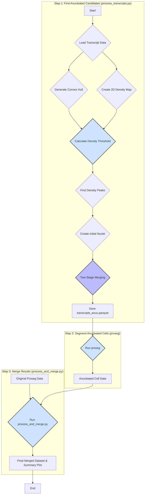

# Anucleated Nuclei Identification Pipeline

This script is designed to solve a specific challenge in 3D spatial transcriptomics (e.g., 10x Xenium): identifying cells whose nuclei were not captured in the imaging plane but whose cell bodies (and thus, transcript clouds) are still present. These "anucleated" cells are often missed by standard segmentation workflows that rely on a DAPI-stained nucleus as a seed.

This pipeline identifies these cells by finding high-density "transcript shadows" in regions previously classified as background. It takes the outputs from a standard Xenium Ranger and [proseg](https://github.com/dcjones/proseg/tree/main) run, identifies new cell candidates, and generates a new transcript file. This new file can then be used as input for a secondary `proseg` run to fully segment these previously missed cells.

The pipeline performs the following key steps:
1.  **Density Map Generation:** Creates a 2D density map from transcript locations.
2.  **Automatic Peak Thresholding:** Intelligently calculates a minimum density threshold to distinguish true peaks from background noise.
3.  **Peak Identification:** Finds all local density maxima that exceed the calculated threshold.
4.  **Nucleus Creation:** Creates initial circular nucleus candidates around the true center of density for each peak.
5.  **Two-Stage Merging & Filtering:** A robust, two-stage process first merges any physically overlapping nuclei and then filters the resulting groups based on the density of the space between them, ensuring only the most prominent peak in a connected region is kept.
6.  **Transcript Assignment:** Assigns transcripts to the newly identified nuclei and calculates their distance to the nearest nucleus.
7.  **Output Generation:** Saves the updated transcript data to a new Parquet file and generates a plot visualizing the final nuclei.

## Analysis Pipeline Workflow

The following diagram illustrates the data flow and decision-making process within the script:



## Workflow Context

The primary goal of this tool is to prepare data for a second `proseg` run.

*   **2D Analysis**: The current implementation works in 2D (`x` and `y` coordinates). Therefore, the subsequent `proseg` run should be performed using the `--ignore-z-coord` option to ensure compatibility.
*   **Input**: The script requires the `transcripts.parquet` and `transcript-metadata.csv.gz` files from a previous segmentation run.
*   **Output**: The output is a modified `transcripts_anuc.parquet` file where the newly identified cell candidates are assigned a `cell_id`. This file is ready to be used as input for a new `proseg` run.

## Installation

To set up the necessary environment, install the required Python packages using the provided `requirements.txt` file:

```bash
pip install -r requirements.txt
```
Note, the current implementation has been tested with python 3.12 on Mac and Linux machines.

## Usage

The script is executed from the command line. All parameters are configurable via command-line arguments.

```bash
python process_transcripts.py [OPTIONS]
```

### Parameters

#### File Paths
*   `--transcript-metadata-file`: Path to the transcript metadata CSV file (e.g., `transcript-metadata.csv.gz`). Default: `transcript-metadata.csv.gz`.
*   `--transcripts-file`: Path to the main transcripts Parquet file. Default: `transcripts.parquet`.
*   `--output-parquet-file`: Path to save the updated transcripts data. Default: `transcripts_anuc.parquet`.
*   `--output-plot-file`: Path to save the output visualization plot. Default: `anucleated_nuclei_plot.png`.

#### Core Algorithm Parameters
*   `--voxel-size`: The size of each square voxel in the 2D histogram, in micrometers (µm). This parameter controls the resolution of the density map. Default: `3.0`.
*   `--density-radius`: The radius around each voxel used to calculate the local transcript density, in micrometers (µm). Default: `12.0`.
*   `--nucleus-radius`: The radius of the final circular nuclei created around the center of density, in micrometers (µm). Default: `3.0`.
*   `--min-transcripts-per-peak`: The minimum number of transcripts required within the `density-radius` to consider a voxel a potential peak. **Set to 0 for automatic calculation (recommended)**. Default: `0`.
*   `--background-sd-multiplier`: A multiplier for the standard deviation of the background density. Used only during automatic threshold calculation. Default: `1.0`.

### Parameter Interactions and Tuning

The most critical and interactive parameters are `--voxel-size`, `--density-radius`, and `--background-sd-multiplier`. Understanding how they work together is key to tuning the algorithm.

1.  **`--voxel-size`**: This sets the fundamental resolution of your analysis.
    *   A **smaller** value (e.g., 1.0) creates a higher-resolution density map. This can be good for separating closely spaced peaks but may increase noise and computation time.
    *   A **larger** value (e.g., 5.0) creates a lower-resolution, smoother map, which can be faster but may merge distinct nearby peaks.

2.  **`--density-radius`**: This defines the "neighborhood" for counting transcripts. It is converted from µm into pixels based on the `voxel-size`. For example, a `density-radius` of 12.0 with a `voxel-size` of 3.0 means the kernel will have a radius of 4 pixels.

3.  **`--background-sd-multiplier`**: This directly controls the sensitivity of the peak detection during automatic thresholding. The threshold is calculated as:
    `Threshold = (Mean + (Multiplier * SD)) * NumVoxelsInKernel`
    *   `Mean` and `SD` are the mean and standard deviation of transcript counts in voxels within the tissue's convex hull.
    *   A **higher** multiplier (e.g., 2.0, 3.0) will result in a higher threshold, leading to the detection of only the most prominent density peaks. Use this if you are getting too many false positives.
    *   A **lower** multiplier (e.g., 0.5, 1.0) will lower the threshold, making the algorithm more sensitive and allowing it to detect weaker peaks. Use this if the algorithm is missing real nuclei.

**How they interact:** The automatic threshold (`min_transcripts_per_peak`) is a product of the per-voxel background estimate and the number of voxels in the density kernel.
*   If you **decrease** `voxel-size`, the number of voxels within the `density-radius` increases quadratically. The algorithm compensates for this by calculating the expected number of transcripts within this larger kernel, making the threshold robust to changes in resolution.
*   The `background-sd-multiplier` is the ultimate lever for sensitivity. After setting reasonable `voxel-size` and `density-radius` values for your tissue, this multiplier should be your primary tool for tuning the number of nuclei detected.

### Secondary `proseg` Run

After running the `process_transcripts.py` script and generating the `transcripts_anuc.parquet` file, the next step is to run `proseg` on this file to segment the newly identified anucleated cell candidates.

```bash
proseg --xenium --enforce-connectivity --ignore-z-coord --nthreads ${NTHREADS} --output-path ./anucleated "transcripts_anuc.parquet"
```

*   `--xenium`: Specifies the Xenium data format.
*   `--enforce-connectivity`: Ensures that all parts of a segmented cell are spatially connected.
*   `--ignore-z-coord`: Crucial for compatibility with the 2D analysis performed by the `process_transcripts.py` script.
*   `--nthreads`: Set the number of threads for parallel processing.
*   `--output-path`: The directory where `proseg` will save its output files (e.g., `cell-metadata.csv.gz`, `union-cell-polygons.geojson.gz`).
*   `"transcripts_anuc.parquet"`: The input file generated by the previous step.

This run will produce a new set of segmentation results, specifically for the anucleated cells.

## Merging Original and Anucleated Results

After running `proseg` on both the original data and the anucleated candidate data, you will have two separate output directories. The `process_and_merge.py` script is used to combine these results into a single, comprehensive dataset.

### How it Works

The script performs the following steps:

1.  **Load Data**: It loads the cell polygons, transcript metadata, and cell metadata from both the original and anucleated `proseg` output directories.
2.  **Sanity Check**: It verifies that the cell centroids from the metadata fall within their corresponding cell polygons.
3.  **Generate Summary Plot**: It creates a scatter plot (`summary_scatterplot.png`) that visualizes the spatial distribution of:
    *   Nucleated transcripts (from the original run).
    *   Anucleated transcripts (from the second run).
    *   Background transcripts.
    *   The boundaries of both nucleated and anucleated cells.
4.  **Calculate Morphology Features**: For both sets of cell polygons, it calculates key morphology metrics like area, perimeter, solidity, and circularity.
5.  **Combine Data**: It merges the metadata, transcript counts, and morphology features for both original and anucleated cells. A new column, `Nucleated`, is added to distinguish between the two cell types (`'Nucleated'` vs. `'Anucleated'`).
6.  **Export**: The final, combined data is saved to a single CSV file: `expected-counts-complete.csv`.

### Usage

```bash
python process_and_merge.py --original_dir <path_to_original_proseg_output> --anucleated_dir <path_to_anucleated_proseg_output> --output_dir <path_for_merged_output>
```

#### Parameters

*   `--original_dir`: Path to the original `proseg` output directory.
*   `--anucleated_dir`: Path to the `proseg` output directory from the anucleated run (e.g., `./anucleated`).
*   `--output_dir`: Path to save the merged results and summary plot.

### Outputs and Interpretation

*   `expected-counts-complete.csv`: A CSV file containing the combined data for all cells. This is the primary output for downstream analysis. Each row corresponds to a cell, and columns include metadata, transcript counts per gene, morphology features, and the `Nucleated` status. One note, as the anucleated cells were defined in 2D rather than 3D, the `volume` column in the output file will be calculated differently between the two and should not be used.
*   `summary_scatterplot.png`: A high-resolution image that provides a visual overview of the segmentation results, allowing you to quickly assess the location and relationship between the originally segmented cells and the newly identified anucleated cells.

## Future Development

A future version of this pipeline is planned to incorporate the Z-dimension for a full 3D analysis, which will eliminate the need for the `--ignore-z-coord` flag in the secondary `proseg` run.
